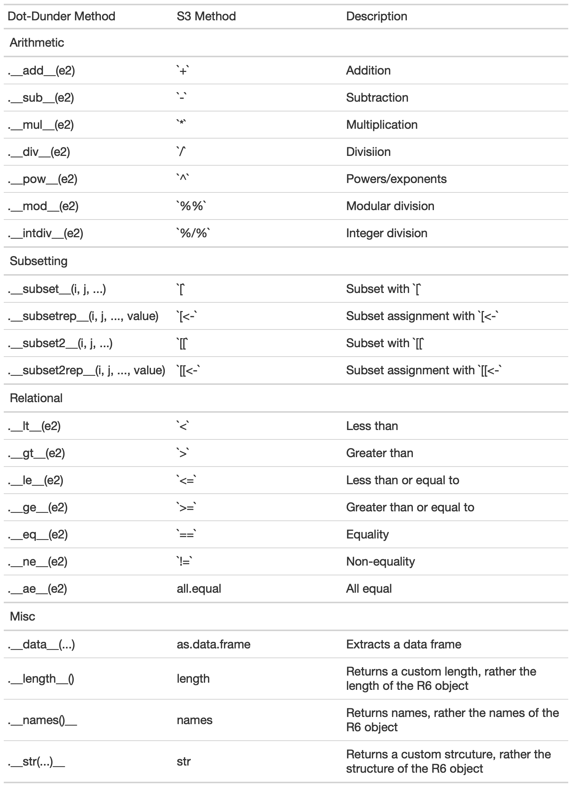

<!-- README.md is generated from README.Rmd. Please edit that file -->

# R6methods

<!-- badges: start -->

[](https://www.tidyverse.org/lifecycle/#experimental)
[](https://github.com/mattwarkentin/R6methods/actions)
<!-- badges: end -->

The goal of `R6methods` is to provide a *lightweight* package that
extends the S3 generic support for `R6` class objects. This package
defines several S3 methods for common `R` generics (e.g. `str()`) and
operators (e.g. `[` or `[<-`) to make it straightforward to define
public methods in your `R6` class and have them *“just work”*.

This package is **very experimental** and liable to change drastically.
Use at your own risk! Developing this package was primarily a learning
experience for working with `R6` and `S3`, and may not have any
practical use.

## Installation

You can install the development version of `R6methods` from
[GitHub](https://github.com/mattwarkentin/R6methods) with:

``` r
remotes::install_github("mattwarkentin/R6methods")
```

## Usage

### Adding `R6methods` to your package

This package is primarily designed for use by `R` package developers. If
you are developing a package which contains `R6` classes, you can save
yourself extra work, such as defining `S3` methods for common `R`
generics. `R6methods` is meant to be a lightweight addition for
providing increased `S3` generic support.

The easiest way to benefit from this package is by depending on
`R6methods` in your package `DESCRIPTION` file.

    Package: mypackage
    Title: My Package Title
    Version: 0.0.0.9000
    Authors@R: 
        person(given = "Jane",
               family = "Doe",
               role = c("aut", "cre"),
               email = "jane.doe@email.com")
    Description: This package...
    Depends:
      R6methods

You may optionally import specific methods using the `@importFrom`
`roxygen2` tag.

### Writing dot-dunder methods

In order to benefit from the `S3` methods provided by `R6methods`, you
simply need to annotate your `R6` class with so-called **dot-dunder**
methods to get immediate support for many common `R` generics. They are
called **dot-dunder** because the methods start with a dot (**.**) and
**d**ouble-**under**score. This syntax and approach borrows inspiration
from the `python` OOP.

These dot-dunder methods must be public methods, and your class must
also inherit the `R6` class (i.e. `R6::R6Class(class = TRUE)`, the
default). Here is a toy example that adds support to an `R6` class `Foo`
for `+`, `-`, and `<` operations.

``` r
library(R6methods)

Foo <- R6::R6Class(
  public = list(
    x = 10,
    .__add__ = function(y) {
      self$x + y
    },
    .__sub__ = function(y) {
      self$x - y
    },
    .__lt__ = function(y) {
      self$x < y
    }
  )
)

foo <- Foo$new()

# Arithmetic
foo + 10
#> [1] 20
foo - 20
#> [1] -10

# Relational
foo < 2
#> [1] FALSE
```

### Supported methods

The table below is a comprehensive list of the dot-dunder methods
currently supported by `R6methods`. When creating your `R6` class, add
any number of the dot-dunder methods (with the same function parameters)
and gain support for the corresponding S3 method.



### Iteration

There is one other special method, `.__getitem__(...)`, which, if
defined, will allow you easily turn your `R6` class into an iterator.
You must also define the `._length__()` method. You can check if your
`R6` instance is iterable by calling
`R6methods::is.iterable(myR6class)`.

If your `R6` instance is iterable, you can call
`R6methods::iter(myR6instance)` to turn your instance into a `coro`
iterator. The returned object is a `generator` (i.e. function factory).
Calling this `generator` will produce an iterator that iterates the
`length()` of your `R6` instance, producing batches of data according to
the `.__getitem__()` method.

``` r
myClass <- R6::R6Class(
  classname = "myClass",
  public = list(
    data = head(mtcars),
    .__length__ = function() {
      nrow(self$data)
    },
    .__getitem__ = function(...) {
      self$data[..1, , drop = FALSE]
    }
  )
)

x <- myClass$new() # Create an instance
gen <- iter(x) # Create the generator
ii <- gen() # Create the iterator

# Collect a single batch
coro::collect(ii, 1)
#> [[1]]
#>           mpg cyl disp  hp drat   wt  qsec vs am gear carb
#> Mazda RX4  21   6  160 110  3.9 2.62 16.46  0  1    4    4

# Collect two batches
coro::collect(ii, 2)
#> [[1]]
#>               mpg cyl disp  hp drat    wt  qsec vs am gear carb
#> Mazda RX4 Wag  21   6  160 110  3.9 2.875 17.02  0  1    4    4
#> 
#> [[2]]
#>             mpg cyl disp hp drat   wt  qsec vs am gear carb
#> Datsun 710 22.8   4  108 93 3.85 2.32 18.61  1  1    4    1

# Collect remaining batches
coro::collect(ii)
#> [[1]]
#>                 mpg cyl disp  hp drat    wt  qsec vs am gear carb
#> Hornet 4 Drive 21.4   6  258 110 3.08 3.215 19.44  1  0    3    1
#> 
#> [[2]]
#>                    mpg cyl disp  hp drat   wt  qsec vs am gear carb
#> Hornet Sportabout 18.7   8  360 175 3.15 3.44 17.02  0  0    3    2
#> 
#> [[3]]
#>          mpg cyl disp  hp drat   wt  qsec vs am gear carb
#> Valiant 18.1   6  225 105 2.76 3.46 20.22  1  0    3    1
coro::collect(ii) # no batches left
#> list()
coro::is_exhausted(ii()) # iterator is exhausted
#> [1] TRUE

# Create new iterator
ii2 <- gen()

# Loop over batches
coro::loop(for (i in ii2) {
  print(i)
})
#>           mpg cyl disp  hp drat   wt  qsec vs am gear carb
#> Mazda RX4  21   6  160 110  3.9 2.62 16.46  0  1    4    4
#>               mpg cyl disp  hp drat    wt  qsec vs am gear carb
#> Mazda RX4 Wag  21   6  160 110  3.9 2.875 17.02  0  1    4    4
#>             mpg cyl disp hp drat   wt  qsec vs am gear carb
#> Datsun 710 22.8   4  108 93 3.85 2.32 18.61  1  1    4    1
#>                 mpg cyl disp  hp drat    wt  qsec vs am gear carb
#> Hornet 4 Drive 21.4   6  258 110 3.08 3.215 19.44  1  0    3    1
#>                    mpg cyl disp  hp drat   wt  qsec vs am gear carb
#> Hornet Sportabout 18.7   8  360 175 3.15 3.44 17.02  0  0    3    2
#>          mpg cyl disp  hp drat   wt  qsec vs am gear carb
#> Valiant 18.1   6  225 105 2.76 3.46 20.22  1  0    3    1
```

## Code of Conduct

Please note that the R6methods project is released with a [Contributor
Code of
Conduct](https://contributor-covenant.org/version/2/0/CODE_OF_CONDUCT.html).
By contributing to this project, you agree to abide by its terms.
